# ELK Stack Installation Guide for AWS EC2


## Table of Contents
- [Overview](#overview)
- [Prerequisites](#prerequisites)
- [EC2 Instance Configuration](#ec2-instance-configuration)
- [Installation Steps](#installation-steps)
- [Post-Installation Configuration](#post-installation-configuration)
- [Verification](#verification)
- [Troubleshooting](#troubleshooting)
- [Security Considerations](#security-considerations)
- [Next Steps](#next-steps)

---

## Overview

This guide walks you through installing the **ELK Stack** (Elasticsearch, Logstash, Kibana) version 9.x on an AWS EC2 instance running Ubuntu. The ELK Stack is a powerful collection of tools for searching, analyzing, and visualizing log data in real-time.

**Components:**
- **Elasticsearch**: Search and analytics engine (stores and indexes data)
- **Logstash**: Data processing pipeline (ingests, transforms, and sends data)
- **Kibana**: Visualization interface (web UI for Elasticsearch)
- **Filebeat**: Lightweight shipper for forwarding logs

---

## Prerequisites

### Required Knowledge
- Basic Linux command line experience
- SSH access to remote servers
- Understanding of AWS EC2 basics
- Familiarity with text editors (nano, vim)

### Tools Needed
- SSH client (Terminal on Mac/Linux, PuTTY on Windows)
- Your EC2 private key (.pem file)
- SCP tool for file transfer

---

## EC2 Instance Configuration

### Recommended Specifications (Non-Production)

| Component | Specification |
|-----------|---------------|
| **Instance Type** | t3.large (2 vCPUs, 8 GB RAM) |
| **Storage** | 50 GB gp3 EBS volume |
| **Operating System** | Ubuntu 22.04 LTS or 24.04 LTS |
| **AMI** | Ubuntu Server (64-bit x86) |

### Security Group Configuration

Configure the following **Inbound Rules**:

| Port | Protocol | Purpose | Source |
|------|----------|---------|--------|
| 22 | TCP | SSH access | Your IP (recommended) or 0.0.0.0/0 |
| 80 | TCP | HTTP (optional, for web proxies) | 0.0.0.0/0 |
| 443 | TCP | HTTPS (optional, for web proxies) | 0.0.0.0/0 |
| 5601 | TCP | Kibana web interface | Your IP (recommended) or 0.0.0.0/0 |
| 9200 | TCP | Elasticsearch REST API | Your IP (recommended) or 0.0.0.0/0 |
| 5044 | TCP | Logstash Beats input | Internal network or specific IPs |
| 9600 | TCP | Logstash monitoring API | Internal network or localhost |

⚠️ **Security Warning**: For production, **never expose ports 9200, 5601, or 5044 to 0.0.0.0/0**. Use VPN, bastion hosts, or IP whitelisting.

### Storage Configuration

1. **Root Volume**: 50 GB minimum
   - Path: `/`
   - Type: gp3 (better performance/cost than gp2)
   - IOPS: 3000 (default)

2. **Optional**: Add a separate data volume for production
   - Mount at `/var/lib/elasticsearch`
   - Size: Based on data retention requirements

---

## Installation Steps

### Step 1: Connect to Your EC2 Instance

#### From Linux/Mac Terminal:

```bash
# Make your private key read-only
chmod 400 /path/to/your-key.pem

# Connect via SSH
ssh -i /path/to/your-key.pem ubuntu@<EC2-PUBLIC-IP>
```

#### From Windows (using PuTTY):
1. Convert `.pem` to `.ppk` using PuTTYgen
2. Open PuTTY
3. Enter EC2 public IP
4. Navigate to Connection → SSH → Auth → Credentials
5. Browse and select your `.ppk` file
6. Click "Open"

**Example:**
```bash
ssh -i ~/Downloads/my-ec2-key.pem ubuntu@54.123.45.67
```

✅ You should see a Ubuntu welcome message when connected.

---

### Step 2: Prepare the Installation Script

On your **local machine**, create the installation script:

```bash
# Create the script file
nano install-elk.sh
```

Paste the following content:

```bash
#!/usr/bin/env bash
set -euo pipefail

echo "========================================="
echo "Installing Elastic Stack 9.x"
echo "========================================="

# 1) Install prerequisites
echo "[1/8] Installing prerequisites..."
sudo apt-get update -y
sudo apt-get install -y wget gnupg apt-transport-https ca-certificates

# 2) Add Elastic signing key
echo "[2/8] Adding Elastic GPG key..."
wget -qO - https://artifacts.elastic.co/GPG-KEY-elasticsearch | \
  sudo gpg --dearmor -o /usr/share/keyrings/elasticsearch-keyring.gpg

# 3) Add Elastic repository (9.x)
echo "[3/8] Adding Elastic repository..."
echo "deb [signed-by=/usr/share/keyrings/elasticsearch-keyring.gpg] https://artifacts.elastic.co/packages/9.x/apt stable main" | \
  sudo tee /etc/apt/sources.list.d/elastic-9.x.list

# 4) Update package list
echo "[4/8] Updating package list..."
sudo apt-get update -y

# 5) Install Elastic components
echo "[5/8] Installing Elasticsearch, Kibana, Logstash, and Filebeat..."
sudo apt-get install -y elasticsearch kibana logstash filebeat

# 6) Configure Kibana to listen on all interfaces
echo "[6/8] Configuring Kibana..."
sudo sed -i.bak '/^[[:space:]]*#server\.host:[[:space:]]*"localhost"[[:space:]]*$/a server.host: 0.0.0.0' /etc/kibana/kibana.yml

# 7) Enable and start services
echo "[7/8] Enabling and starting services..."
sudo systemctl daemon-reload
sudo systemctl enable --now elasticsearch
sudo systemctl enable --now kibana
sudo systemctl enable --now logstash
sudo systemctl enable --now filebeat

# 8) Configure Logstash with Elasticsearch certificate
echo "[8/8] Configuring Logstash..."
sudo mkdir -p /etc/logstash/certs
sudo cp /etc/elasticsearch/certs/http_ca.crt /etc/logstash/certs/http_ca.crt
sudo chown root:logstash /etc/logstash/certs/http_ca.crt
sudo chmod 640 /etc/logstash/certs/http_ca.crt

# Create test Logstash configuration
sudo tee /etc/logstash/conf.d/test.conf >/dev/null <<'EOF'
input {
  stdin { }
}
output {
  elasticsearch {
    hosts => ["https://localhost:9200"]
    user => "elastic"
    password => "<password>"
    ssl_enabled => true
    ssl_certificate_authorities => "/etc/logstash/certs/http_ca.crt"
    index => "logstash-test-%{+YYYY.MM.dd}"
  }
  stdout { codec => rubydebug }
}
EOF

# Restart services
sudo systemctl restart kibana
sudo systemctl restart logstash

echo "========================================="
echo " Installation Complete!"
echo "========================================="
echo ""
echo "Next steps:"
echo "1. Reset the elastic user password"
echo "2. Generate Kibana enrollment token"
echo "3. Access Kibana at http://<EC2-PUBLIC-IP>:5601"
```

Save and exit (Ctrl+X, then Y, then Enter in nano).

---

### Step 3: Transfer Script to EC2

Use **SCP** (Secure Copy) to transfer the script:

#### From Linux/Mac:
```bash
# Make the script executable locally
chmod +x install-elk.sh

# Transfer to EC2
scp -i /path/to/your-key.pem install-elk.sh ubuntu@<EC2-PUBLIC-IP>:~/
```


---

### Step 4: Execute the Installation Script

Back in your **SSH session** on the EC2 instance:
```
bash install-elk.sh
```
OR
```bash
# Make the script executable
chmod +x install-elk.sh

# Run the installation
./install-elk.sh
```

⏱️ **Expected Duration**: 5-10 minutes depending on network speed.

**What happens during installation:**
1. System packages are updated
2. Elastic GPG key is added for package verification
3. Elastic repository (9.x) is added to APT sources
4. Elasticsearch, Kibana, Logstash, and Filebeat are installed
5. Kibana is configured to accept connections from any IP
6. All services are enabled to start on boot
7. Logstash is configured with Elasticsearch SSL certificate
8. Services are started

**Monitoring the installation:**
- Watch for any error messages (red text)
- Installation is successful if you see "Installation Complete!"

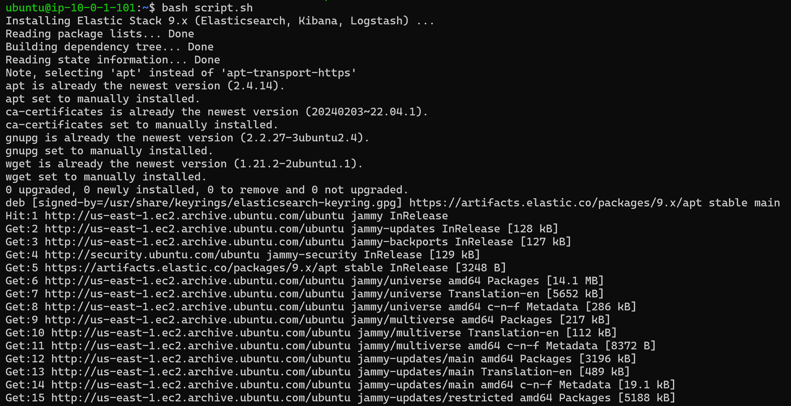
---
### sudo systemctl status elasticsearch
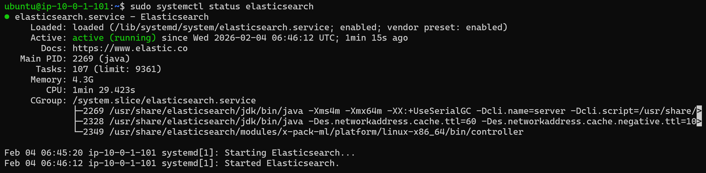

### sudo systemctl status kibana


### sudo systemctl status filebeat
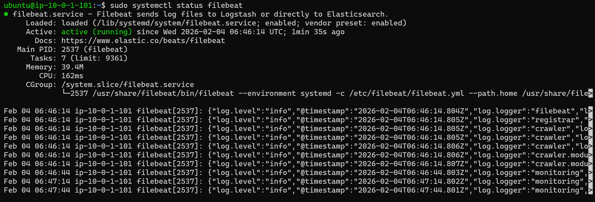

### sudo systemctl status logstash
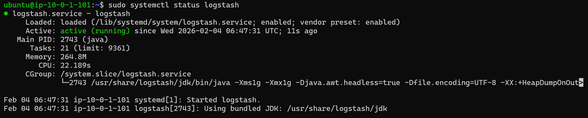

## Post-Installation Configuration

### Step 5: Reset the Elastic User Password

Elasticsearch 9.x enables security by default and creates an auto-generated password during installation.

#### 5.1: Generate Initial Password

```bash
sudo /usr/share/elasticsearch/bin/elasticsearch-reset-password -u elastic
```

**Sample Output:**
```
This tool will reset the password of the [elastic] user to an autogenerated value.
The password will be printed in the console.
Please confirm that you would like to continue [y/N]y

Password for the [elastic] user successfully reset.
New value: xK9pL2mN8qR5vT3wY7zB
```

📝 **Important**: Copy this password immediately! You'll need it in the next step.

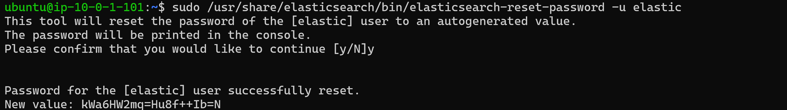


#### 5.2: Export the Auto-Generated Password

```bash
# Replace with YOUR auto-generated password from previous step
export ES_PASS="xK9pL2mN8qR5vT3wY7zB"
```

**What this does**: Creates a temporary environment variable to store the password for the next command.

#### 5.3: Set Your Custom Password

Now, change to a password of your choice:

```bash
curl -k -u elastic:$ES_PASS \
  -X POST https://localhost:9200/_security/user/elastic/_password \
  -H "Content-Type: application/json" \
  -d '{
    "password": "MyStrongPassword@123"
  }'
```
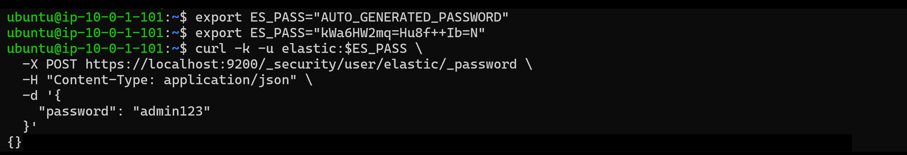

**Expected Response:**
```json
{}
```

✅ An empty JSON object `{}` means success!

**Password Requirements:**
- Minimum 8 characters (recommended: 12+)
- Mix of uppercase, lowercase, numbers, symbols
- Avoid common words or patterns

**Example of a strong password:**
```
Elk$tack2026!Secure
```

📝 **Save this password securely** - you'll need it for:
- Elasticsearch API access
- Kibana login
- Logstash configuration

---

### Step 6: Generate Kibana Enrollment Token

Kibana needs a token to securely connect to Elasticsearch:

```bash
sudo /usr/share/elasticsearch/bin/elasticsearch-create-enrollment-token -s kibana
```

**Sample Output:**
```
eyJ2ZXIiOiI5LjMuMCIsImFkciI6WyIxMC4wLjEuMTAxOjkyMDAiXSwiZmdyIjoiYTc4ZGY5MmU4Y2JkNGE3ZThhZjNiOWM0ZDVlNmY3YTg1Mjk3ZWI0YjNkNGY2ZTg3OWMyMGY1YTc4ZGY5MmU4YyIsImtleSI6ImpOX19wSTRCUXhMZEFBQUFBQUFBIn0=
```

📋 **Copy this entire token** - you'll paste it into Kibana shortly.

**What this token contains:**
- Elasticsearch cluster information
- Security credentials
- Connection settings

⏰ **Token expiration**: Valid for 30 minutes by default. Generate a new one if expired.

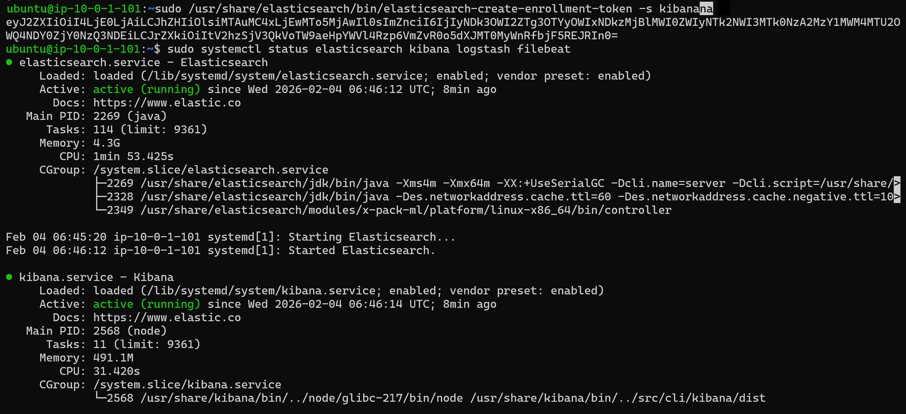

---

## Verification

### Step 7: Verify Elasticsearch is Running

Test the Elasticsearch API using curl:

```bash
curl -k -u elastic:MyStrongPassword@123 https://localhost:9200
```

**Expected Response:**
```json
{
  "name" : "ip-10-0-1-101",
  "cluster_name" : "elasticsearch",
  "cluster_uuid" : "GRO-TehlRsqv0YoSXQfZyQ",
  "version" : {
    "number" : "9.3.0",
    "build_flavor" : "default",
    "build_type" : "deb",
    "build_hash" : "17b451d8979a29e31935fe1eb901310350b30e62",
    "build_date" : "2026-01-29T10:05:46.708397977Z",
    "build_snapshot" : false,
    "lucene_version" : "10.3.2",
    "minimum_wire_compatibility_version" : "8.19.0",
    "minimum_index_compatibility_version" : "8.0.0"
  },
  "tagline" : "You Know, for Search"
}
```
✅ **Success indicators:**
- You receive JSON response
- Status code is 200
- Version shows 9.x.x

**Understanding the flags:**
- `-k`: Ignore SSL certificate warnings (self-signed cert)
- `-u elastic:PASSWORD`: HTTP basic authentication

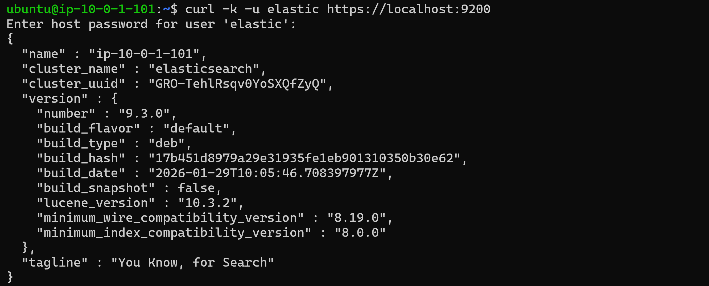
---

### Step 8: Access Kibana Web Interface

#### 8.1: Open Kibana in Your Browser

Navigate to:
```
http://<EC2-PUBLIC-IP>:5601
```

**Example:**
```
http://54.123.45.67:5601
```

⏱️ **First load**: May take 30-60 seconds as Kibana initializes.

#### 8.2: Enter Enrollment Token

You'll see a page asking for an enrollment token.

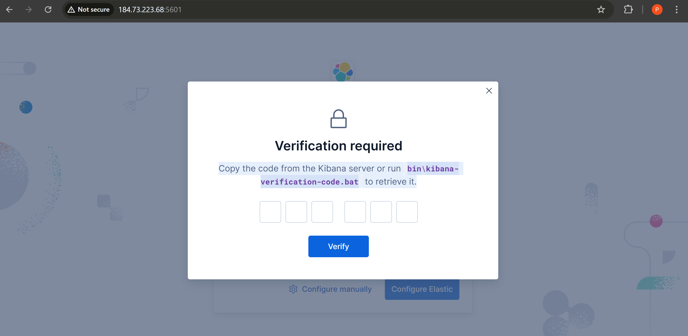

**Steps:**
1. Paste the enrollment token from Step 6
2. Click "Configure Elastic"
3. Wait for connection to establish (10-30 seconds)

**What's happening:**
- Kibana registers with Elasticsearch
- Security certificates are exchanged
- Connection is established

#### 8.3: Get Verification Code

Kibana will now ask for a **verification code**.

**Back in your SSH terminal**, run:

```bash
sudo /usr/share/kibana/bin/kibana-verification-code
```

**Sample Output:**
```
Your verification code is:  123 456
```


**The code format:**
- Six digits
- Shown with a space in the middle
- Valid for a few minutes

#### 8.4: Complete Kibana Setup

**In your browser:**
1. Enter the 6-digit verification code
2. Click "Verify"
3. You'll be redirected to the login page

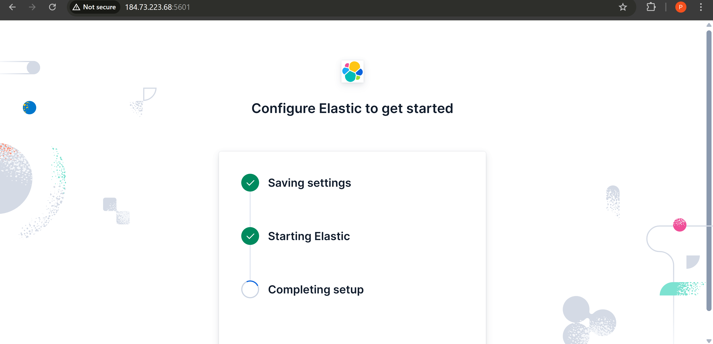

**Login credentials:**
- **Username**: `elastic`
- **Password**: Your custom password (from Step 5.3)

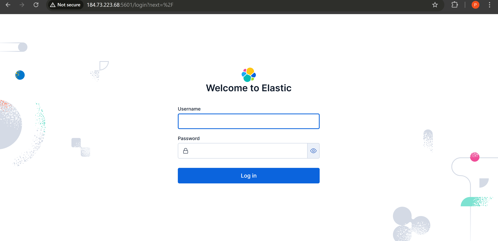

🎉 **Success!** You should now see the Kibana home page.


**First time on Kibana?** You'll see:
- Welcome screen with quick start options
- Sample data sets you can add
- Navigation menu on the left


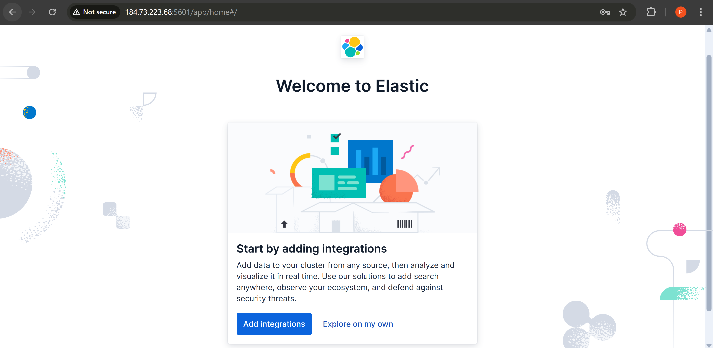

---

### Step 9: Verify All Services

Check that all ELK components are running:

```bash
# Check Elasticsearch
sudo systemctl status elasticsearch

# Check Kibana
sudo systemctl status kibana

# Check Logstash
sudo systemctl status logstash

# Check Filebeat
sudo systemctl status filebeat
```

**Expected output for each:**
```
● elasticsearch.service - Elasticsearch
   Loaded: loaded (/lib/systemd/system/elasticsearch.service; enabled)
   Active: active (running) since ...
```

✅ Look for **"active (running)"** in green text.

---

### Step 10: Update Logstash Configuration

The installation script created a test configuration, but you need to update it with your actual password.

```bash
# Edit the Logstash configuration
sudo nano /etc/logstash/conf.d/test.conf
```

**Find this line:**
```
password => "<password>"
```

**Replace with your actual password:**
```
password => "MyStrongPassword@123"
```

**Save and exit** (Ctrl+X, Y, Enter).

**Restart Logstash:**
```bash
sudo systemctl restart logstash
```

**Verify Logstash is running:**
```bash
sudo systemctl status logstash
```

---

## Troubleshooting

### Common Issues and Solutions

#### Issue 1: Cannot Access Kibana (Connection Timeout)

**Symptoms:**
- Browser shows "Unable to connect"
- Connection times out

**Solutions:**

1. **Check Security Group**:
   - Verify port 5601 is open
   - Confirm your IP is allowed (or 0.0.0.0/0 for testing)

2. **Verify Kibana is running**:
   ```bash
   sudo systemctl status kibana
   ```

3. **Check Kibana logs**:
   ```bash
   sudo journalctl -u kibana -f
   ```

4. **Restart Kibana**:
   ```bash
   sudo systemctl restart kibana
   ```

#### Issue 2: Elasticsearch Not Starting

**Check available memory:**
```bash
free -h
```

**Elasticsearch requires at least 2GB RAM**. For t3.large (8GB), this should be sufficient.

**View Elasticsearch logs:**
```bash
sudo journalctl -u elasticsearch -f
```

**Common fixes:**

1. **Increase heap size** (if you have more RAM):
   ```bash
   sudo nano /etc/elasticsearch/jvm.options.d/heap.options
   ```
   
   Add:
   ```
   -Xms4g
   -Xmx4g
   ```
   
   (Sets heap to 4GB - use half your available RAM)

2. **Restart Elasticsearch**:
   ```bash
   sudo systemctl restart elasticsearch
   ```

#### Issue 3: Password Authentication Failed

**Reset password again:**
```bash
sudo /usr/share/elasticsearch/bin/elasticsearch-reset-password -u elastic -i
```

The `-i` flag allows you to enter a password interactively.

#### Issue 4: Enrollment Token Expired

**Generate a new token:**
```bash
sudo /usr/share/elasticsearch/bin/elasticsearch-create-enrollment-token -s kibana
```

**Note**: Old token becomes invalid after use or expiration.

#### Issue 5: Disk Space Issues

**Check disk usage:**
```bash
df -h
```

**If /var is full:**
```bash
# Clean up old logs
sudo journalctl --vacuum-time=7d

# Remove old Elasticsearch snapshots (if any)
sudo rm -rf /var/lib/elasticsearch/nodes/*/indices/*
```

### Useful Diagnostic Commands

```bash
# Check all ELK services at once
sudo systemctl status elasticsearch kibana logstash filebeat

# View real-time logs
sudo journalctl -u elasticsearch -f
sudo journalctl -u kibana -f
sudo journalctl -u logstash -f

# Check which ports are listening
sudo netstat -tulpn | grep -E '5601|9200|5044|9600'

# Test Elasticsearch cluster health
curl -k -u elastic:MyStrongPassword@123 https://localhost:9200/_cluster/health?pretty
```

---

## Security Considerations

### 🔒 Important Security Recommendations

#### 1. **Restrict Security Group Access**

**For production or even serious testing**, restrict access:

```
Port 22  (SSH)         → Your IP only
Port 5601 (Kibana)     → Your office IP range or VPN
Port 9200 (Elasticsearch) → localhost only (remove from security group)
Port 5044 (Logstash)   → Application servers only
Port 9600 (Logstash)   → localhost only (remove from security group)
```

#### 2. **Use Strong Passwords**

- Minimum 16 characters
- Use a password manager
- Never use default passwords
- Rotate passwords regularly

#### 3. **Enable HTTPS for Kibana**

By default, Kibana uses HTTP. For production:

```bash
# Generate self-signed certificate (or use Let's Encrypt)
sudo openssl req -x509 -nodes -days 365 -newkey rsa:2048 \
  -keyout /etc/kibana/kibana.key \
  -out /etc/kibana/kibana.crt

# Edit Kibana config
sudo nano /etc/kibana/kibana.yml
```

Add:
```yaml
server.ssl.enabled: true
server.ssl.certificate: /etc/kibana/kibana.crt
server.ssl.key: /etc/kibana/kibana.key
```

Restart:
```bash
sudo systemctl restart kibana
```

Access via: `https://<EC2-IP>:5601`

#### 4. **Use Reverse Proxy (Nginx)**

For production, never expose Kibana directly:

```bash
# Install Nginx
sudo apt-get install -y nginx

# Create Nginx config for Kibana
sudo nano /etc/nginx/sites-available/kibana
```

Add:
```nginx
server {
    listen 80;
    server_name your-domain.com;

    location / {
        proxy_pass http://localhost:5601;
        proxy_set_header Host $host;
        proxy_set_header X-Real-IP $remote_addr;
    }
}
```

Enable and restart:
```bash
sudo ln -s /etc/nginx/sites-available/kibana /etc/nginx/sites-enabled/
sudo systemctl restart nginx
```

#### 5. **Firewall Configuration**

Enable UFW (Uncomplicated Firewall):

```bash
# Allow SSH first (important!)
sudo ufw allow 22/tcp

# Allow Kibana through Nginx
sudo ufw allow 80/tcp
sudo ufw allow 443/tcp

# Enable firewall
sudo ufw enable
```

#### 6. **Regular Updates**

```bash
# Update Elastic Stack (check release notes first!)
sudo apt-get update
sudo apt-get upgrade elasticsearch kibana logstash filebeat

# Restart services after upgrade
sudo systemctl restart elasticsearch kibana logstash filebeat
```

#### 7. **Backup Configuration**

```bash
# Create backup directory
mkdir -p ~/elk-backups

# Backup configurations
sudo cp /etc/elasticsearch/elasticsearch.yml ~/elk-backups/
sudo cp /etc/kibana/kibana.yml ~/elk-backups/
sudo cp /etc/logstash/logstash.yml ~/elk-backups/
sudo cp -r /etc/logstash/conf.d ~/elk-backups/
```

---

## Next Steps

### 1. **Explore Kibana**

**Try Sample Data:**
1. Click on "Home" in Kibana
2. Select "Try sample data"
3. Add "Sample web logs" or "Sample eCommerce orders"
4. Explore pre-built dashboards

### 2. **Configure Filebeat**

Send system logs to Elasticsearch:

```bash
# Edit Filebeat configuration
sudo nano /etc/filebeat/filebeat.yml
```

**Configure output to Elasticsearch:**
```yaml
output.elasticsearch:
  hosts: ["localhost:9200"]
  protocol: "https"
  username: "elastic"
  password: "MyStrongPassword@123"
  ssl.certificate_authorities: ["/etc/elasticsearch/certs/http_ca.crt"]
```

**Enable system module:**
```bash
sudo filebeat modules enable system
sudo filebeat setup
sudo systemctl restart filebeat
```

**Verify in Kibana:**
1. Go to "Discover"
2. Create index pattern: `filebeat-*`
3. View your system logs

### 3. **Create Your First Dashboard**

1. Navigate to "Analytics" → "Dashboard"
2. Click "Create dashboard"
3. Add visualizations
4. Save your dashboard

### 4. **Configure Logstash Pipelines**

Create pipelines for different data sources:

```bash
# Create a pipeline for application logs
sudo nano /etc/logstash/conf.d/app-logs.conf
```

**Example pipeline:**
```ruby
input {
  beats {
    port => 5044
  }
}

filter {
  if [type] == "app-log" {
    grok {
      match => { "message" => "%{TIMESTAMP_ISO8601:timestamp} %{LOGLEVEL:level} %{GREEDYDATA:message}" }
    }
  }
}

output {
  elasticsearch {
    hosts => ["https://localhost:9200"]
    user => "elastic"
    password => "MyStrongPassword@123"
    ssl_enabled => true
    ssl_certificate_authorities => "/etc/logstash/certs/http_ca.crt"
    index => "app-logs-%{+YYYY.MM.dd}"
  }
}
```

Restart Logstash:
```bash
sudo systemctl restart logstash
```

### 5. **Monitor Cluster Health**

**Via API:**
```bash
curl -k -u elastic:MyStrongPassword@123 \
  https://localhost:9200/_cluster/health?pretty
```

**In Kibana:**
1. Navigate to "Stack Monitoring"
2. Enable monitoring if prompted
3. View cluster metrics, node statistics, index health

### 6. **Set Up Alerts**

Create alerts for important events:

1. Go to "Stack Management" → "Rules and Connectors"
2. Click "Create rule"
3. Choose rule type (e.g., "Elasticsearch query")
4. Configure conditions
5. Set up actions (email, Slack, etc.)

### 7. **Learn More**

**Official Documentation:**
- [Elasticsearch Guide](https://www.elastic.co/guide/en/elasticsearch/reference/current/index.html)
- [Kibana Guide](https://www.elastic.co/guide/en/kibana/current/index.html)
- [Logstash Guide](https://www.elastic.co/guide/en/logstash/current/index.html)
- [Filebeat Guide](https://www.elastic.co/guide/en/beats/filebeat/current/index.html)

**Tutorials:**
- [Elastic Stack Getting Started](https://www.elastic.co/guide/en/elastic-stack-get-started/current/get-started-elastic-stack.html)
- [Kibana Sample Data](https://www.elastic.co/guide/en/kibana/current/get-started.html#gs-get-data-into-kibana)

---

## Production Considerations

If moving to production, consider:

### 1. **Scaling Resources**

| Environment | Instance Type | RAM | Storage | Elasticsearch Heap |
|-------------|---------------|-----|---------|-------------------|
| Development | t3.large | 8 GB | 50 GB | 4 GB |
| Staging | t3.xlarge | 16 GB | 100 GB | 8 GB |
| Production (small) | m5.2xlarge | 32 GB | 500 GB | 16 GB |
| Production (medium) | m5.4xlarge | 64 GB | 1 TB | 31 GB |

### 2. **Multi-Node Cluster**

For high availability, run:
- 3+ Elasticsearch nodes (master-eligible)
- 2+ Kibana instances (behind load balancer)
- 2+ Logstash instances

### 3. **Data Retention Policies**

Configure Index Lifecycle Management (ILM):
- Hot tier: Recent data (SSD)
- Warm tier: Older data (HDD)
- Cold tier: Archive (cheap storage)
- Delete: After retention period

### 4. **Monitoring and Alerting**

- Enable Stack Monitoring
- Set up alerts for disk space, memory, query performance
- Configure log aggregation for Elasticsearch logs themselves

### 5. **Disaster Recovery**

- Regular snapshots to S3
- Automated backup scripts
- Documented restore procedures
- Tested recovery processes

---

## Summary

You've successfully installed and configured the ELK Stack on AWS EC2! Here's what you accomplished:

✅ Configured EC2 instance with proper security groups  
✅ Installed Elasticsearch 9.x with security enabled  
✅ Installed and configured Kibana  
✅ Installed Logstash with SSL certificate  
✅ Installed Filebeat for log shipping  
✅ Secured the elastic user with a custom password  
✅ Connected Kibana to Elasticsearch  
✅ Verified all services are running  

**Your ELK Stack is now ready to ingest, search, and visualize data!**

---

## Quick Reference

### Service Management Commands

```bash
# Start services
sudo systemctl start elasticsearch
sudo systemctl start kibana
sudo systemctl start logstash
sudo systemctl start filebeat

# Stop services
sudo systemctl stop elasticsearch
sudo systemctl stop kibana
sudo systemctl stop logstash
sudo systemctl stop filebeat

# Restart services
sudo systemctl restart elasticsearch
sudo systemctl restart kibana
sudo systemctl restart logstash
sudo systemctl restart filebeat

# Check status
sudo systemctl status elasticsearch
sudo systemctl status kibana
sudo systemctl status logstash
sudo systemctl status filebeat

# Enable on boot
sudo systemctl enable elasticsearch
sudo systemctl enable kibana
sudo systemctl enable logstash
sudo systemctl enable filebeat
```

### Important File Locations

```bash
# Configuration files
/etc/elasticsearch/elasticsearch.yml
/etc/kibana/kibana.yml
/etc/logstash/logstash.yml
/etc/logstash/conf.d/          # Pipeline configurations
/etc/filebeat/filebeat.yml

# Data directories
/var/lib/elasticsearch/         # Elasticsearch data
/var/lib/kibana/                # Kibana data
/var/lib/logstash/              # Logstash data

# Log files
/var/log/elasticsearch/
/var/log/kibana/
/var/log/logstash/
/var/log/filebeat/

# Certificates
/etc/elasticsearch/certs/
/etc/logstash/certs/
```

### Common API Endpoints

```bash
# Cluster health
curl -k -u elastic:PASSWORD https://localhost:9200/_cluster/health?pretty

# Node info
curl -k -u elastic:PASSWORD https://localhost:9200/_nodes?pretty

# List indices
curl -k -u elastic:PASSWORD https://localhost:9200/_cat/indices?v

# Kibana health
curl http://localhost:5601/api/status
```

---

## Support and Community

- **Elastic Community Forums**: https://discuss.elastic.co/
- **GitHub Issues**: https://github.com/elastic/
- **Documentation**: https://www.elastic.co/guide/
- **Stack Overflow**: Tag questions with `elasticsearch`, `kibana`, `logstash`

---

**Last Updated**: February 2026  
**ELK Version**: 9.x  
**Tested On**: Ubuntu 22.04 LTS, Ubuntu 24.04 LTS

---

*Happy Logging! 🎉*


